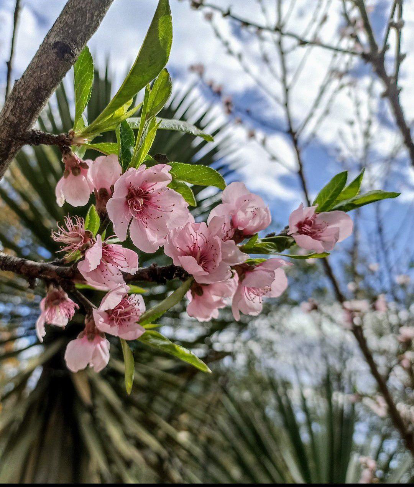

D: I don't know what to do.
T: Be yourself, love.
D: _But_, I don't know who I am, only who I want to be.
T: That's not a way to live. Could you picture me trying to be a willow instead of a peach tree?
D: No! You are astonishing as you are, don't change a thing, please!
T: That's what I am trying to tell you.
D: _But_, I stammer and ramble. I don't have clarity or
structure in my ideas. I hate it.
T: Do you think I organize my petals, brush my leaves, or polish my
bark? I let them be, love. I follow the path of life and channel its
energy through me.
D: _But_, you look gorgeous, I couldn't find a fault even if I
tried.
T: That's because you see me with the eyes of love. You find beauty in
every scar, genius in each broken twig, care in fragile buds. That's how
 you should look at yourself.
D: _But_, I can't.
T: Practice, little one. Practice.
D: _But_, how?
T: Practice isn't always so straightforward. Soften your gaze and you’ll perceive the subtleties of nature.
D: _But.._
T: See through, my love. See through. Learn to find kindness in all of
what you think of as your shortcomings, and you'll find grace. Remember, nothing in nature is wasted.
Lie back, and see how each part of you belongs to the whole.

