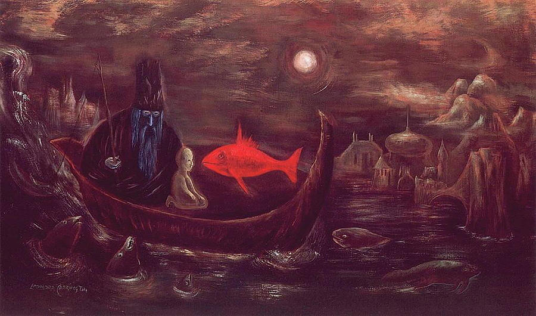
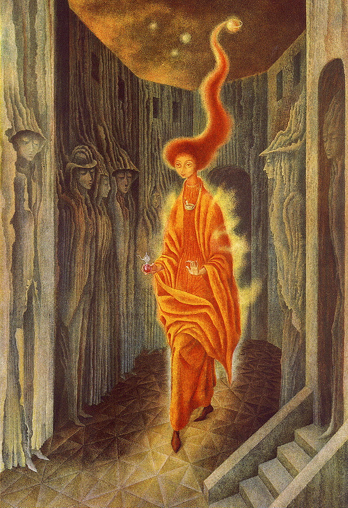

It was the big red fish.
He was calling me
with its vibrant, fresh rouge
luring me as the bait
in a fishing rod.

"No", said the fish,
it was your delicate step
who beckoned for my attention.
The tincture in your slender hands
from which I drank.

We recognized each other
at a distance. Our eyes,
meeting behind the veil
of casual existence.

Kindred spirits,
spiraling down the path,
to the depths of imagination,
where machinations
are not disturbed.

I wouldn’t know
the longing of this connection,
if it weren’t for your blue,
the golden aura that covers your fire,
takes me back into the womb.

Is this the call of friendship
that I hear? The mystic experience
of truth. I had seen in it my dreams,
the one in vibrant colors, I shall heed.

